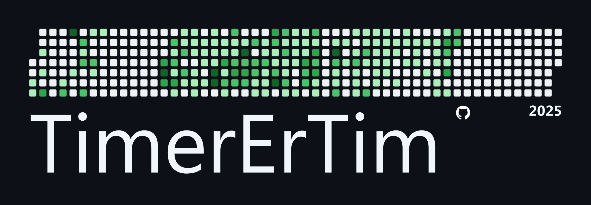

## GitHub Contribution Sticker

Generates an SVG GitHub sticker based on your username and yearly contributions.



### Features
- Renders a GitHub-style contribution heatmap as a printable sticker
- Dark and light themes
- Outputs both SVG and PDF

### Quickstart (recommended: mise)
This repo includes tasks and tool versions via `mise`.

1) Install mise: [docs](https://mise.jdx.dev)
2) In the repo root, run:

```bash
mise install
mise run build-sticker
```

Outputs are written to `out/sticker.svg` and `out/sticker.pdf`.

### Manual usage (without mise)
Prereqs: `typst`, `yq`, `curl` available on PATH.

```bash
# Fetch yearly contributions into contribution-stats/<username>_<year>.json
bash mise-tasks/fetch-contributions

# Build sticker as SVG and PDF
typst c --format svg sticker.typ out/sticker.svg
typst c --format pdf sticker.typ out/sticker.pdf
```

### Configure
Edit `config.toml`:

```toml
username = "TimerErTim"
year = "2025"
theme = "dark"  # "dark" or "light"
```

Notes
- Theme controls background, text, and heatmap colors.
- The sticker uses the `Segoe UI` font by default (see `sticker.typ`).
  - You can place fonts in the local `fonts/` directory. The environment sets `TYPST_FONT_PATHS=./fonts` via `.mise.toml`.
  - Or change the font in `sticker.typ` (`set text(font: "..." )`).

### Tasks
- `fetch-contributions`: Reads `config.toml` and downloads contributions from `gh-contributions-api.vercel.app` to `contribution-stats/`.
- `build-sticker`: Depends on `fetch-contributions`, then builds `out/sticker.svg` and `out/sticker.pdf` with Typst.

Run with mise:

```bash
mise run fetch-contributions
mise run build-sticker
```

### Troubleshooting
- Missing fonts: Add the font files (e.g., TTF/OTF) to `fonts/` or change the font in `sticker.typ`.
- API/network errors: Verify `username` and `year` in `config.toml` and check connectivity.

### Printing providers
- [PrettyGoodStickers](https://www.prettygoodstickers.com/)

### License
MIT © 2025 TimerErTim


